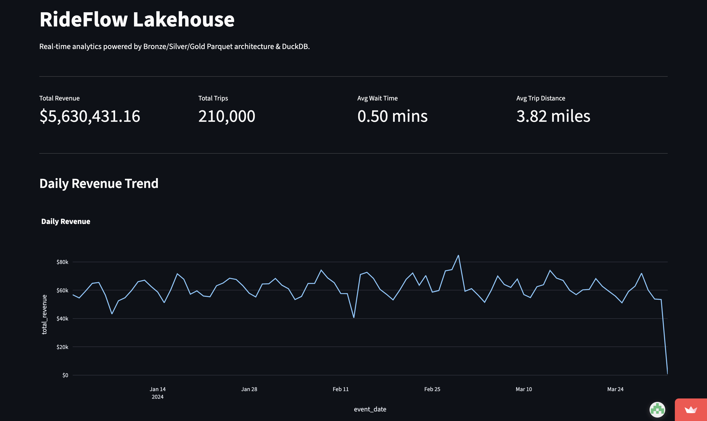
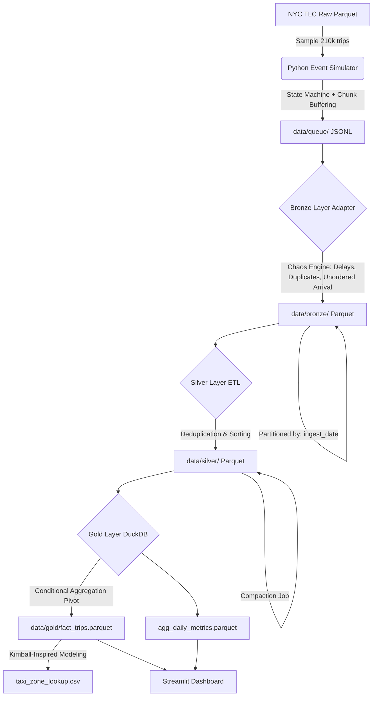

# 🚖 RideFlow Analytics: A Mobility Data Lakehouse

> A production-inspired mobility data lakehouse that transforms real New York City Taxi and Limousine Commission (TLC) trip data into a simulated ride-hailing event stream. By introducing late arrivals, duplicates, and out-of-order events, it demonstrates resilient ingestion, idempotent processing, partitioned Parquet storage, and dimensional analytics.

**Live Dashboard:** [RideFlow Analytics](https://rideflow-dashboard.streamlit.app/)


---

### 📸 Dashboard



*Interactive Streamlit dashboard powered by the Gold Parquet datasets.*

---

### 📌 At a Glance

|                   |                                       |
| ----------------- | ------------------------------------- |
| **Source**        | NYC TLC Trip Record Data              |
| **Scale**         | 210K trips                            |
| **Storage**       | Apache Parquet with Hive partitioning |
| **Processing**    | Python + Polars                       |
| **Analytics**     | DuckDB                                |
| **Visualization** | Streamlit + Plotly                    |
| **Key Challenge** | Late, duplicate & out-of-order events |
| **Pipeline**      | Bronze → Silver → Gold                |

---

### ⏱️ The Core Concept: `event_time` vs `ingest_time`

The architectural foundation of this project is the separation of when an event occurred in the physical world versus when the database received it.

* **`event_time` (Timestamp):** When the ride actually happened (e.g., Jan 15 at 10:00 AM).
* **`ingest_time` (Ingest Timestamp):** When the pipeline received the event (e.g., Jan 17 at 2:00 PM).

Because of mobile network failures, events arrive out of order and days late. The pipeline must handle `ingest_date` partitioning in Bronze, but re-partition by `event_date` in Silver to ensure accurate historical analytics.

---

### 🧠 Engineering Highlights & Design Decisions

**1. The Chaos Engine (Simulated Network Failures)**

Public datasets only provide completed trips. To simulate real-world mobile network failures, the Bronze Adapter injects operational anomalies into the event stream:

* **Late Arrivals:** 5% of events are delayed by 1-48 hours, forcing the pipeline to handle out-of-order data.
* **App Retries:** 1% of events are duplicated to simulate API retry logic.
* **Unordered Arrival:** Events are physically shuffled before writing to simulate concurrent API requests arriving out of chronological order.

**2. Idempotent Silver ETL & Compaction**

* **Dynamic Lineage Routing:** Because of late arrivals, a single Bronze file contains multiple event dates. The Silver ETL groups data by `event_date` and writes to dynamically named files (`ingest_YYYY-MM-DD_original.parquet`) to guarantee zero overwrites.
* **Solving the Small File Problem:** The chaos injection fragmented data into 6,500+ tiny files. A DuckDB compaction job reads all files, merges them into ~90 consolidated files, and performs a safe directory swap (`tmp` -> `silver`).

**3. Source-to-Gold Data Reconciliation**

Instead of trusting the pipeline, a metadata manifest is generated at the source capturing the exact expected row counts and revenue totals. A validation script queries both this manifest and the final Gold layer using DuckDB, verifying that expected counts and revenue totals are preserved despite duplicate, delayed, and out-of-order ingestion.

* *Result:* 210,000 source trips | $5.6M source revenue | 0 unexplained count/revenue discrepancy.

**4. Query Optimization (Partition Pruning)**

* Data is physically partitioned using Hive partitioning (`event_date=YYYY-MM-DD/`).
* When DuckDB queries `WHERE event_date = '2024-01-16'`, the query optimizer uses **Partition Pruning** to skip 91 out of 92 files on disk (verified via `EXPLAIN`), achieving sub-second query times on a 150MB dataset.

**5. Kimball-Inspired Dimensional Modeling**

The Gold layer doesn't just aggregate; it flattens the event stream into a `fact_trips` table using conditional aggregation (`MAX(CASE WHEN event_type=...`). This fact table is joined with `taxi_zone_lookup.csv` as a denormalized dimension, enabling operational analytics (Peak Hours, Wait Times, Borough Revenue).

---

### 🛠 Tech Stack

* **Processing:** Python, Polars (Lazy Evaluation, Rust Engine)
* **Storage:** Apache Parquet (Hive Partitioning)
* **Query Engine:** DuckDB (In-process OLAP)
* **Visualization:** Streamlit, Plotly
* **Data Source:** NYC Taxi & Limousine Commission (TLC) Trip Record Data

---

### 📐 Architecture



---

### 🚀 How to Run Locally

1. **Clone the repository**

   ```bash
   git clone https://github.com/flmeHashira/RideFlow.git
   cd RideFlow
   ```

2. **Set up the virtual environment**

   ```bash
   python3 -m venv venv
   source venv/bin/activate
   pip install -r requirements.txt
   ```

3. **Run the Dashboard (Using Pre-materialized Gold Data)**

   *(The repository includes the pre-materialized `data/gold/` Parquet files, so the dashboard can run immediately without re-running the pipeline.)*

   ```bash
   streamlit run dashboard.py
   ```

4. **Rebuild the Entire Pipeline from Scratch**

   First, download the raw NYC TLC data into `data/raw/`:

   ```bash
   mkdir -p data/raw

   curl -o data/raw/yellow_tripdata_2024-01.parquet \
   https://d37ci6vzurychx.cloudfront.net/trip-data/yellow_tripdata_2024-01.parquet

   curl -o data/raw/yellow_tripdata_2024-02.parquet \
   https://d37ci6vzurychx.cloudfront.net/trip-data/yellow_tripdata_2024-02.parquet

   curl -o data/raw/yellow_tripdata_2024-03.parquet \
   https://d37ci6vzurychx.cloudfront.net/trip-data/yellow_tripdata_2024-03.parquet

   curl -o data/raw/taxi_zone_lookup.csv \
   https://d37ci6vzurychx.cloudfront.net/misc/taxi_zone_lookup.csv
   ```

   Then, run the pipeline scripts in order:

   ```bash
   python src/simulator/generator.py
   python src/pipeline/bronze_etl.py
   python src/pipeline/silver_etl.py
   python src/pipeline/compact_silver.py
   python src/pipeline/gold_etl.py
   python validate_pipeline.py  # Verify source-to-gold reconciliation
   ```
